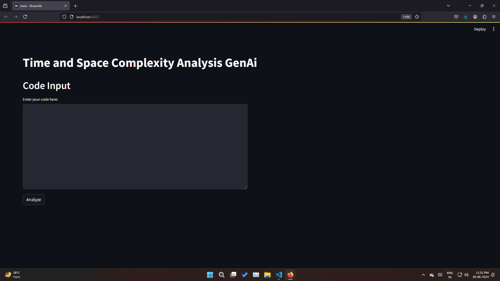
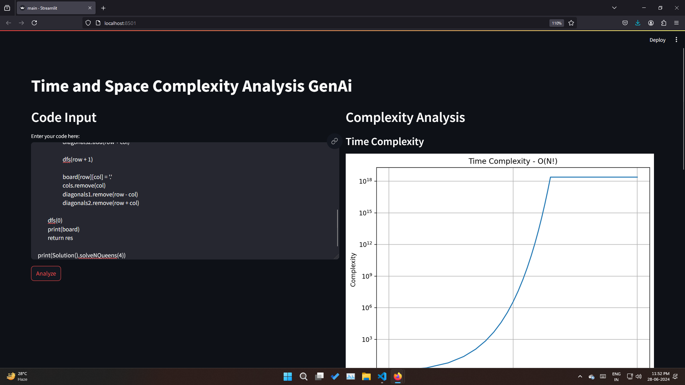
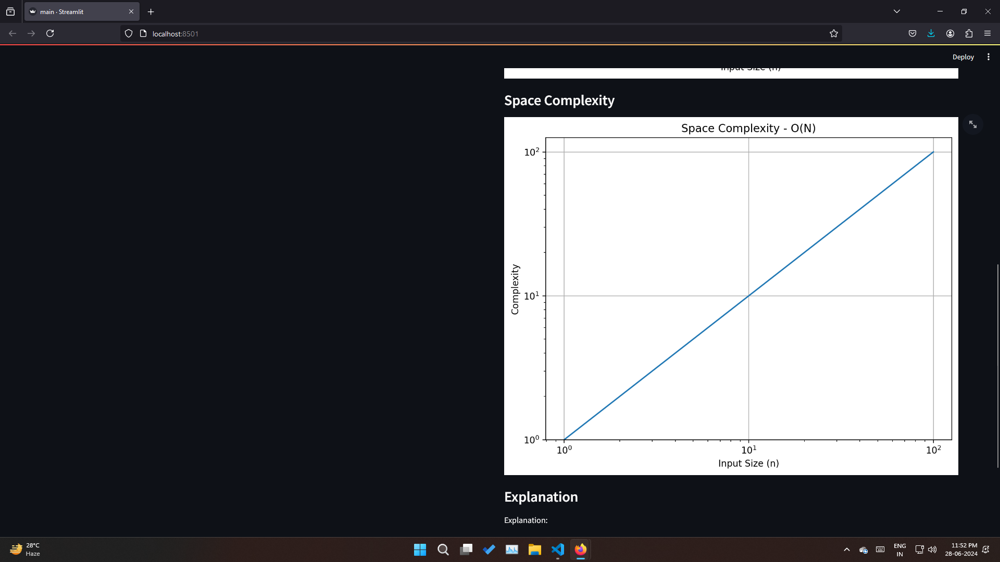
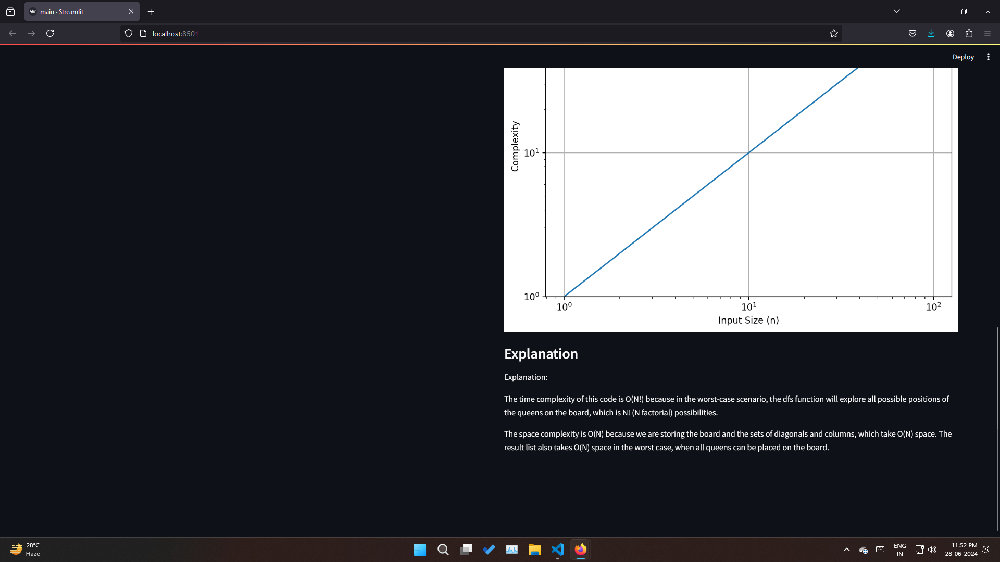

# DSA-Gen

This project provides a tool to analyze the time and space complexity of Python code using advanced language models and visualize the results.

## Repository Structure

```
DSA-Gen/
│
├── LLM.py                 # Script for language model integration and code analysis
├── main.py                # Main Streamlit application script
└── README.md              # This file
```

## Setup

1. Clone the repository:
   ```
   git clone https://github.com/Pragateeshwaran/GenAi-Verse.git
   cd GenAi-Verse/DSA-Gen
   ```

2. Install the required dependencies:
   ```
   pip install -r requirements.txt
   ```

3. Set up your Groq Key:
   - From Groq Playground get the API key and replace it in LLM.py with 'xx..xx'

## Usage

Run the main application script:
```
streamlit run main.py
```

This will start a Streamlit web application where you can input Python code to analyze its time and space complexity.

## Demo






## Features

- Input Python code through a user-friendly interface
- Analyze time complexity of the input code
- Analyze space complexity of the input code
- Visualize complexity graphs for both time and space
- Provide detailed explanations of the complexity analysis

## Dependencies

- Streamlit
- NumPy
- Matplotlib
- Langchain
- Groq

For a complete list of dependencies, see `requirements.txt`.

## Contributing

Contributions are welcome! Please feel free to submit a Pull Request.

## Contact

Pragateeshwaran - geniuspekka1808@gmail.com

Project Link: [https://github.com/Pragateeshwaran/GenAi-Verse](https://github.com/Pragateeshwaran/GenAi-Verse)
